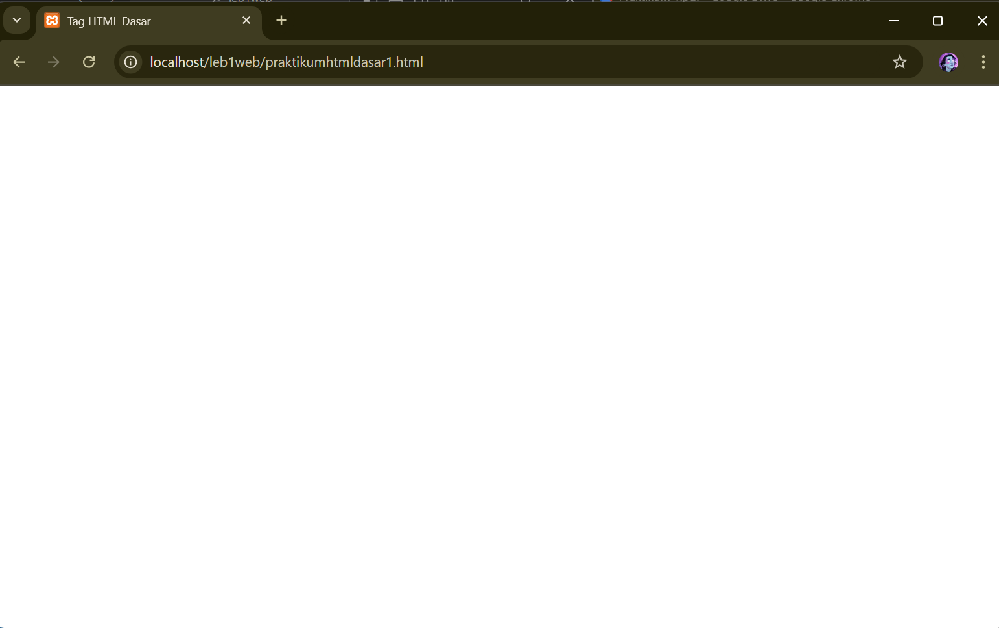
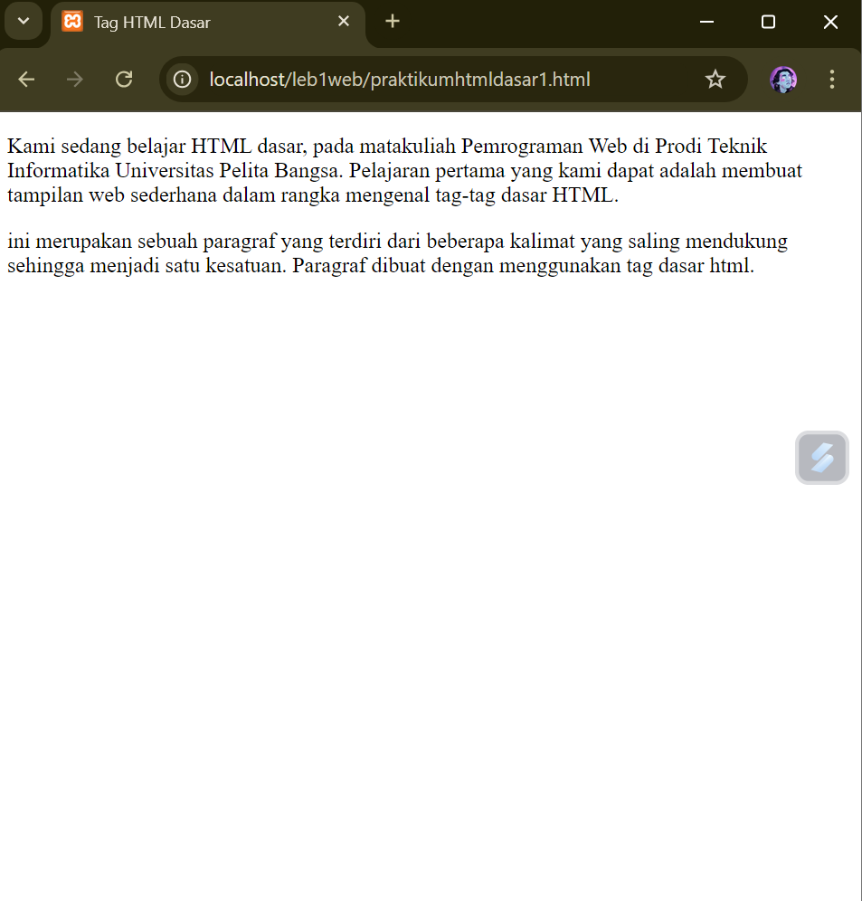
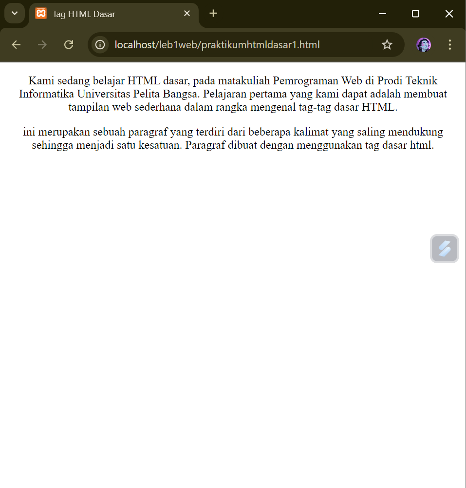
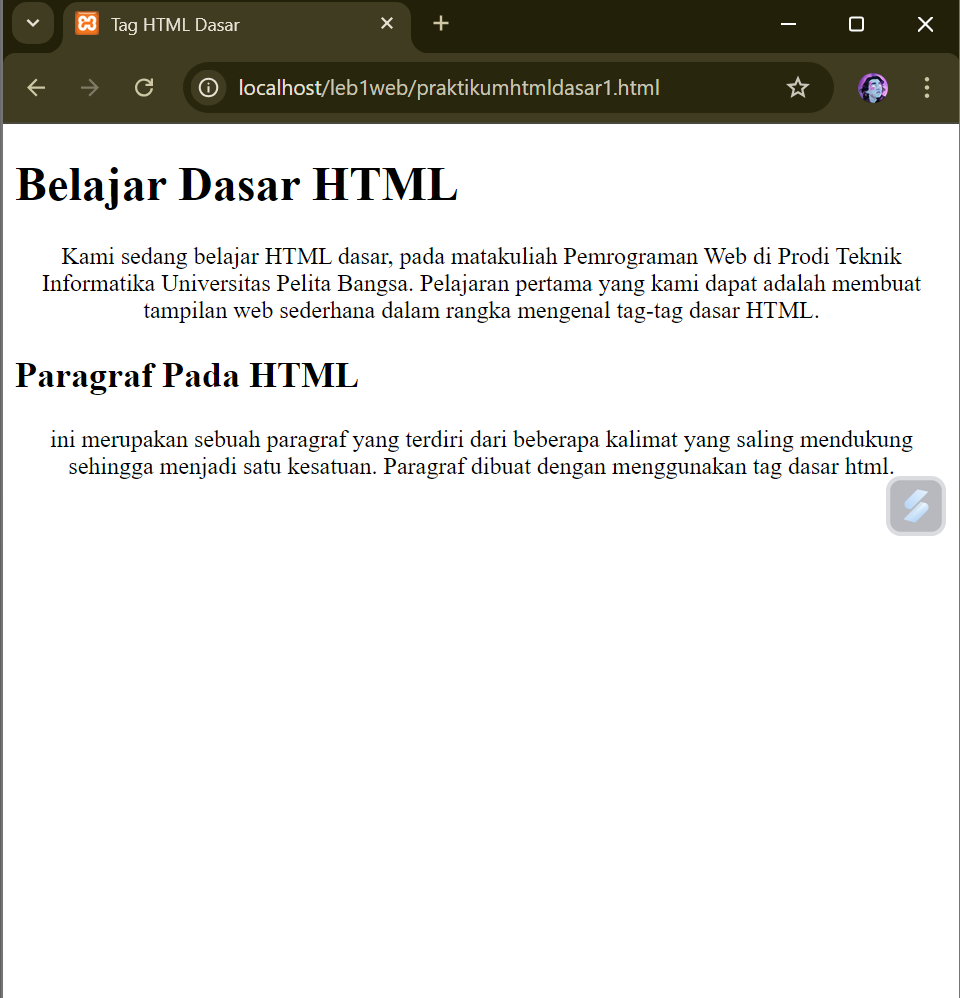
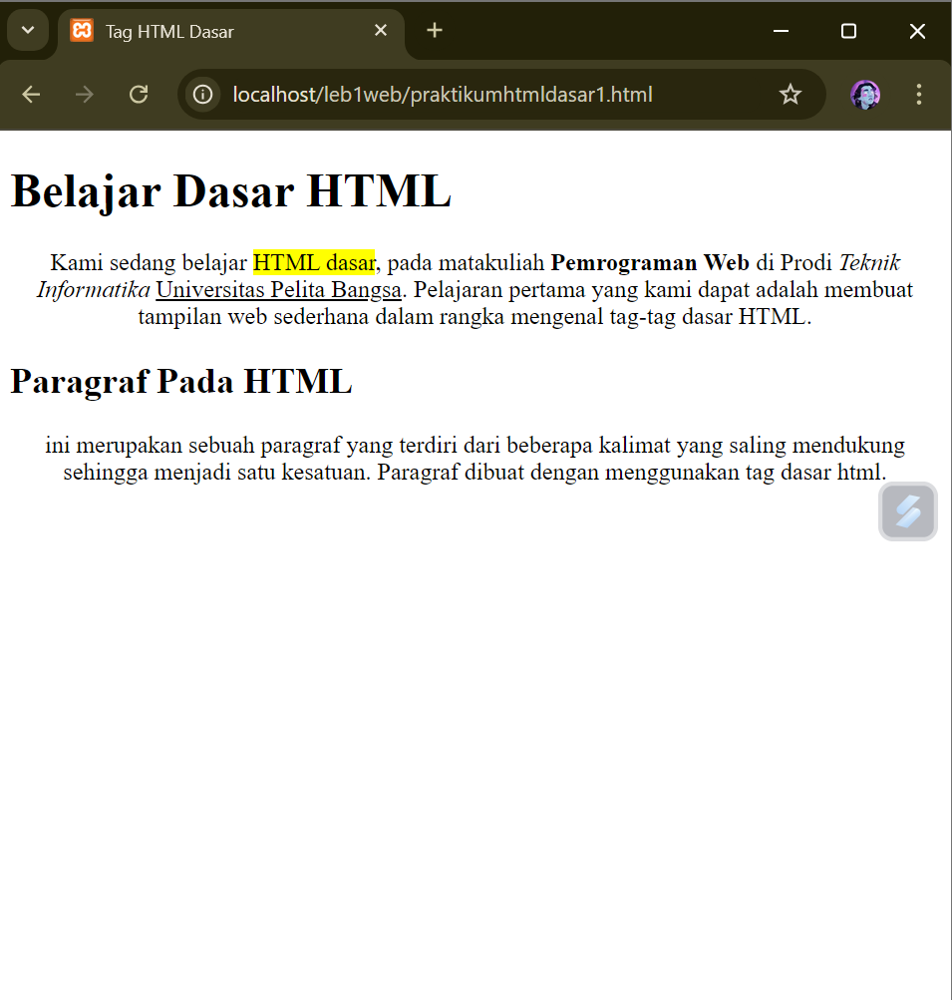
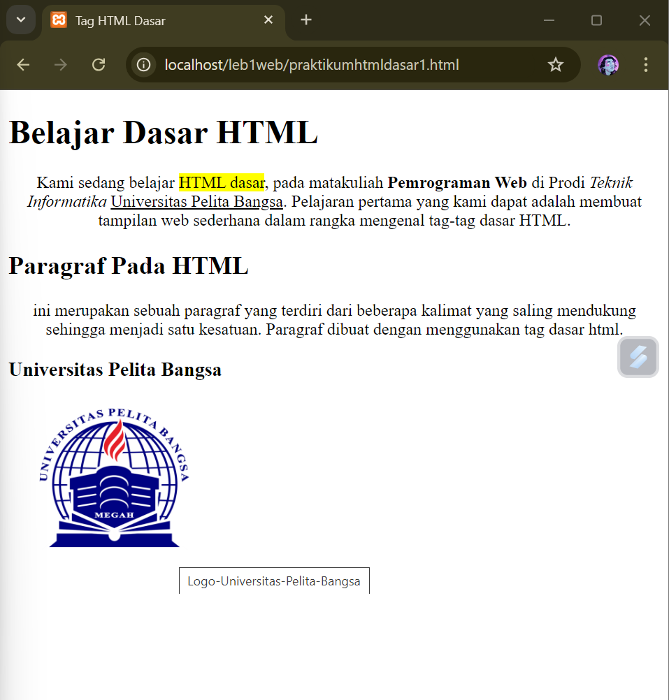
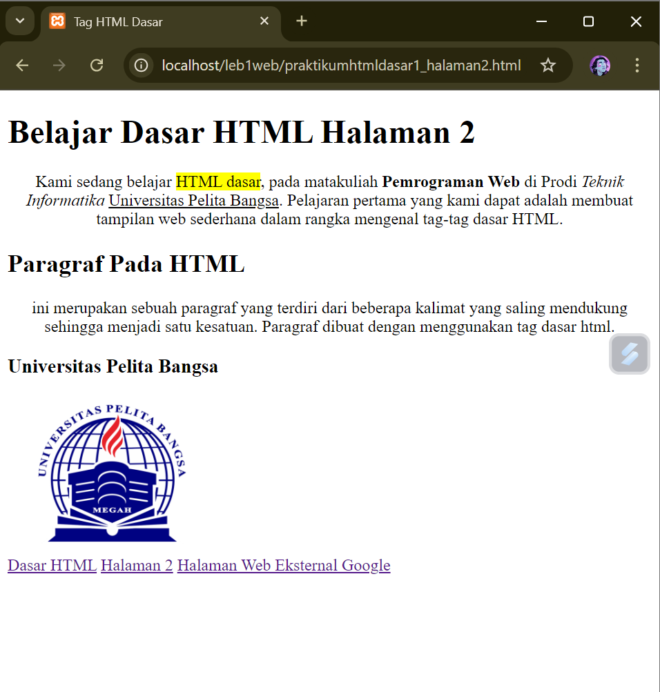

# dewisalsa

## 1. Menambahkan file baru praktikum1 dan menambahkan tag dasar dokumen HTML.
- Gambar result

## 2. Kemudian membuat beberapa paragraf sederhana
- Gambar result 

## 3. Kemudian atur atribut paragraf dan menambahkan sub judul
- Gambar 1

-Gambar result 1

## 4. Format teks pada paragraf tersebut
- Gambar result

## 5. Kemudian menyisipkan gambar kepada halaman web dan menambahkan judul
- Gambar result

## 6. Menambahkan hyperlink pada dokumen tersebut
- Gambar result

